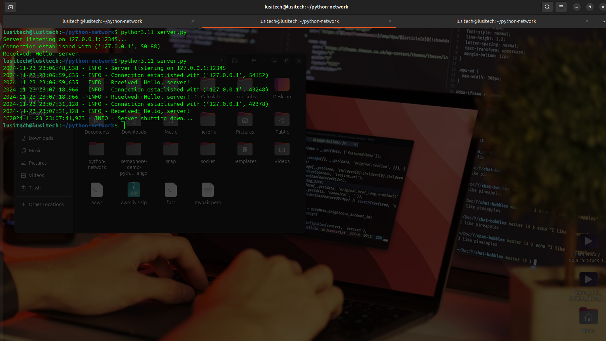

# Python Network Lab

A robust implementation of a client-server socket communication system in Python, demonstrating basic network programming concepts with error handling and logging.

## Features

- **Echo Server**: Accepts connections and echoes back received messages
- **Client Implementation**: Connects to server and sends/receives messages
- **Error Handling**: Comprehensive error management for network operations
- **Logging**: Detailed logging of all operations and errors
- **Type Hints**: Python type annotations for better code maintainability
- **Clean Architecture**: Object-oriented design with clear separation of concerns

## Requirements

- Python 3.7+
- No external dependencies required (uses standard library only)

## Installation

1. Clone the repository or download the source files:
   ```bash
   git clone https://github.com/hamdani2020/python-network 
   cd python-network
   ```

2. Ensure you have Python 3.7 or higher installed:
   ```bash
   python --version
   ```

## Usage

### Starting the Server

1. Open a terminal and navigate to the project directory
2. Run the server:
   ```bash
   python3 server.py
   ```
   
3. The server will start listening on localhost (127.0.0.1) port 12345

### Running the Client

1. Open another terminal window
2. Run the client:
   ```bash
   python3 client.py
   ```
   
3. The client will connect to the server, send a test message, and display the response

### Custom Configuration

Both server and client can be configured by modifying the initialization parameters:

```python
# Custom server configuration
server = EchoServer(host="0.0.0.0", port=8080, max_connections=10)

# Custom client configuration
client = EchoClient(host="192.168.1.100", port=8080)
```

## Architecture

### Server (`server.py`)

- **EchoServer class**:
  - `setup_socket()`: Initializes server socket with error handling
  - `accept_connection()`: Handles incoming client connections
  - `handle_client()`: Manages client communication
  - `run()`: Main server loop

### Client (`client.py`)

- **EchoClient class**:
  - `connect()`: Establishes connection to server
  - `send_message()`: Handles message transmission and response
  - `close()`: Cleans up resources
  - `run()`: Main client operation sequence

## Error Handling

The implementation includes comprehensive error handling for common scenarios:

- Socket creation failures
- Connection errors
- Data transmission issues
- Resource cleanup
- Unexpected disconnections

## Logging

Both server and client implement logging with:

- Timestamp
- Log level
- Detailed error messages
- Connection status
- Data transmission details

## Best Practices Implemented

1. **Resource Management**:
   - Proper socket cleanup
   - Context managers for resource handling
   - Error recovery mechanisms

2. **Code Organization**:
   - Class-based structure
   - Separation of concerns
   - Clear method responsibilities

3. **Security Considerations**:
   - Configurable host/port
   - Connection validation
   - Proper error messages

4. **Maintainability**:
   - Type hints
   - Comprehensive documentation
   - Consistent code style

## Limitations

- Single-threaded implementation (one client at a time)
- Basic echo functionality only
- No encryption/security features
- No authentication mechanism

## Future Improvements

1. Multi-threading support for multiple simultaneous clients
2. SSL/TLS encryption
3. Authentication system
4. Message protocol implementation
5. Connection pooling
6. Asynchronous operations using `asyncio`
7. Configuration file support
8. Unit tests

## Contributing

Feel free to contribute to this project by:

1. Forking the repository
2. Creating a feature branch
3. Committing your changes
4. Opening a pull request

## License

This project is licensed under the MIT License - see the LICENSE file for details.

## Acknowledgments

- [Python Socket Programming Documentation](https://docs.python.org/3/library/socket.html)
- [Socket Programming in Python](https://realpython.com/python-sockets/)
- [Simple Python App that makes network request using socket library](https://www.youtube.com/watch?v=x1ZGfeGX7pI)
- Network Programming Best Practices
- Python Type Hints PEP 484
